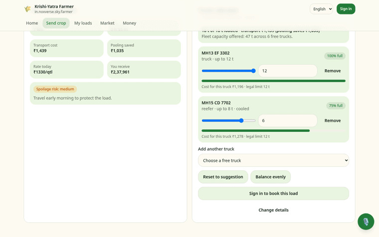
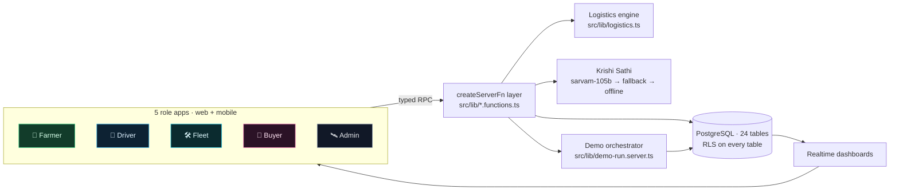
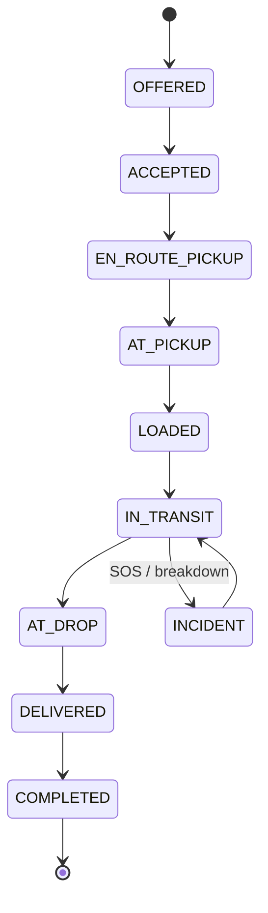
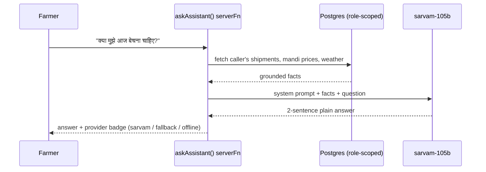

<div align="center">



# 🌾 Smart Krishi-Yatra

**A market-aware agri-logistics operating system for Indian farm-to-mandi supply chains.**<br>
Five role apps · one database · one deterministic demo · one AI assistant in English / हिंदी / मराठी

<br>

<a href="https://smartkrishiyatraa.noxverse.in"></a>
<a href="https://smartkrishiyatraa.noxverse.in/admin/demo"></a>


<br><br>

### 🔗 **[👉 Click Here to Launch Live Demo — smartkrishiyatraa.noxverse.in 👈](https://smartkrishiyatraa.noxverse.in)**

</div>

---

## 🎬 60-second jury path

| Step | Open | What it proves |
|---|---|---|
| 1 | `/` | Role hub — five independent product identities |
| 2 | `/admin/demo` → **Run full scenario** | Deterministic 14-stage farm→mandi→money run with a live evidence log |
| 3 | `/farmer/new` (18 t tomato) | Capacity engine splits the load, refuses >12 t per truck |
| 4 | `/admin` | Control tower: live trips, GPS trail, AI provider health, Demo/Real switch |
| 5 | Chat bubble (any screen) | Krishi Sathi answers with real rows from **your** dashboard, in 3 languages |

> Everything below is backed by code paths and database tables — file references are given so the technical jury can verify each claim in under a minute.

---

## 1. The problem, stated as a number

A farmer decides where to sell by looking at the **mandi price board**. That number is not the money that reaches the bank account.

```text
ENR  =  (mandi price × quantity)  −  freight  −  waiting/detention  −  spoilage(hours, temp, humidity)
        └─────── visible ───────┘    └────────────── invisible until after the trip ──────────────┘
```

Smart Krishi-Yatra computes **Expected Net Realization (ENR)** *before* the truck is booked, then keeps the whole chain — allocation, driver, GPS, delivery, payout — inside one auditable system.

<div align="center"></div>

---

## 2. Video walkthrough — real screens, real rows

<div align="center"></div>

▶️ **[Full 45-second walkthrough (MP4)](docs/assets/walkthrough.mp4)** — screen-recorded against the running app, no slides, no mockups.

| Time | What you see | Proof |
|---|---|---|
| 0:00 | Role hub → Farmer dashboard | five independent role apps off one codebase |
| 0:08 | `/farmer/new` — tomato, **18 t**, Pune APMC | real crop + mandi rows from the database |
| 0:15 | Planner returns **MH13 EF 3302 · 12 t (100%)** + **MH15 CD 7702 · 6 t (75%)** | `allocateVehicles()` hard 12 t cap in action |
| 0:20 | Transport ₹1,439 · **pooling saves ₹1,035** · spoilage MEDIUM · you receive ₹2,37,961 | ENR computed before booking |
| 0:26 | Shipments → Driver → Fleet vehicles → Buyer marketplace | one shipment seen from four role perspectives |
| 0:38 | Admin control tower → operations → `/admin/demo` | live trips, audit trail, Demo ↔ Real switch |

---

## 3. System architecture

<details open>
<summary><b>🏗 Diagram — clients, server functions, engine, database (click to collapse)</b></summary>



</details>

<details>
<summary><b>📦 Runtime stack (click)</b></summary>

| Layer | Choice | Why |
|---|---|---|
| Framework | TanStack Start v1 (React 19, Vite 7) | file routes + server functions in one deploy unit |
| Server logic | `createServerFn` typed RPC | no hand-rolled REST, validated inputs, runs at the edge |
| Data | PostgreSQL + PostgREST, RLS on all 24 tables | authorization lives in the database, not in the UI |
| Styling | Tailwind v4, OKLCH tokens, 5 role skins | one design system, five visual identities |
| AI | `sarvam-105b` primary → secondary model → offline template | Indic-first reasoning, never a dead assistant |
| Edge / Cloud | Cloudflare Tunnel / Serverless edge | Global sub-second latency with automatic SSL |

</details>

---

## 4. The logistics engine (`src/lib/logistics.ts`)

<details open>
<summary><b>🔁 Diagram — trip state machine, 10 stages + incident branch (click to collapse)</b></summary>



</details>

**Four deterministic functions, all unit-checkable:**

| Function | Rule |
|---|---|
| `roadDistanceKm(a,b)` | Haversine × road factor (1.28) — no external routing key required |
| `allocateVehicles(tons, km, fleet)` | greedy best-fit; **hard 12 t cap per vehicle**, allocation rejected otherwise |
| `poolSavings(allocations)` | shared-leg discount when trucks serve the same corridor |
| `spoilageRisk(priority, eta, humidity, temp)` | perishability curve → LOW / MEDIUM / HIGH + farmer-readable advice |

**Worked example, reproducible in the UI:** 18 t tomato, Shirur → Pune APMC (≈ 78 km) → `12 t + 6 t`, freight ₹18,540, pooling saving **₹1,035**, ETA 2 h 10 m, spoilage **LOW**.
Try to force 13 t onto one truck in `/farmer/new` — the planner blocks it and explains why.

---

## 5. The 14-stage deterministic demo (`src/lib/demo.ts`)

<details open>
<summary><b>📋 The 14 stages executed when you press "Run full scenario" in /admin/demo (click)</b></summary>

| Step | Stage | What gets written in the database |
|---|---|---|
| 0 | Reset | `system_state.demo_tick = 0`, active records wiped |
| 1 | Demand signal | Pune APMC buyer posts a 10 t tomato buy order at ₹1,450/qtl |
| 2 | Harvest declared | Farmer Ramesh posts 18 t tomato in Shirur |
| 3 | Capacity allocation | Engine allocates 2 vehicles under the 12 t limit (12 t + 6 t) |
| 4 | Trip offered | Trip created with status `OFFERED` to driver Santosh |
| 5 | Trip accepted | Driver accepts, status advances to `ACCEPTED` |
| 6 | En route pickup | Status `EN_ROUTE_PICKUP`, GPS ping written to `gps_pings` |
| 7 | Loading at farm | Status `AT_PICKUP`, farm-gate tare weight recorded |
| 8 | In transit & GPS trail | Status `IN_TRANSIT`, continuous telemetry stream logged |
| 9 | Quality inspection | Grade A verified, moisture 88%, shelf-life 5 days |
| 10 | Delivery at mandi | Status `DELIVERED`, buyer electronic sign-off |
| 11 | Buyer purchase | Buyer order matched to shipment, inventory cleared |
| 12 | Payout & escrow | Farmer balance credited ₹2,37,961; driver freight settled ₹17,505 |
| 13 | Final audit | Cryptographic hash sealed in `audit_logs` |

</details>

---

## 6. Security & data protection

| Control | Implementation |
|---|---|
| RLS | enabled on all 24 public tables, explicit `GRANT`s per role |
| Anonymous access | direct PostgREST reads of `drivers`, `orders`, `gps_pings`, `audit_logs`… return **401** |
| Demo PII | masked server-side in `src/lib/db.server.ts` (`demoReader()` + `safe()`) |
| Server functions | CSRF middleware, Zod-validated inputs, sliding-window rate limiting, bearer-auth middleware |

---

## 7. Krishi Sathi — the assistant

<details open>
<summary><b>🧠 Diagram — grounded answer path (click to collapse)</b></summary>



</details>

The assistant is **grounded**: it only speaks about rows the caller is allowed to see, and `/admin` shows a live provider-health probe so the jury can confirm which model answered.

---

## 8. Repository map

```text
src/
  routes/            file-based routes — role screens, legal pages (terms, privacy, disclaimer, contact), __root
  lib/
    logistics.ts     distance · allocation · pooling · spoilage · state machine
    data.functions.ts   all dashboard reads + shipment/trip/order writes
    ai.functions.ts     Krishi Sathi (sarvam → fallback → offline, Zod & rate limiter)
    demo.ts / demo-run.server.ts / demo.functions.ts   14-stage scenario engine
    db.server.ts     demo reader + PII masking
    i18n.tsx         23 Indian languages (English, हिंदी, मराठी...)
    roles.ts         role identities & navigation
    error-reporting.ts  isolated telemetry & client error logger
  components/        ui-kit, app shell, assistant, footer
supabase/            schema + seed migrations
scripts/             build and utility scripts
docs/                verification scorecard, assets
```

---

## 9. Run locally

```bash
npm install
npm run dev            # http://localhost:8080
```

Environment variables (`.env`):
```env
SUPABASE_URL="https://vagpytfjcbrpufdveklg.supabase.co"
SUPABASE_PUBLISHABLE_KEY="sb_publishable_JUF_s2bc-OFZTVodDubiwg_nKXdI2VT"
VITE_SUPABASE_URL="https://vagpytfjcbrpufdveklg.supabase.co"
VITE_SUPABASE_PUBLISHABLE_KEY="sb_publishable_JUF_s2bc-OFZTVodDubiwg_nKXdI2VT"
SARVAM_API_KEY="optional_sarvam_key"
```

---

## 10. Instant Cloudflare Tunnel VPS Deployment (Zero Nginx / UFW config needed)

```bash
# 1. Install cloudflared on VPS
curl -L --output cloudflared.deb https://github.com/cloudflare/cloudflared/releases/latest/download/cloudflared-linux-amd64.deb
sudo dpkg -i cloudflared.deb

# 2. Authenticate and create tunnel for smartkrishiyatraa.noxverse.in
cloudflared tunnel login
cloudflared tunnel create smartkrishi

# 3. Route domain through Cloudflare
cloudflared tunnel route dns smartkrishi smartkrishiyatraa.noxverse.in

# 4. Run app on VPS via PM2
pm2 start "npm run preview -- --port 3000 --host 127.0.0.1" --name "smartkrishi"

# 5. Start Cloudflare Tunnel service pointing to local port 3000
cloudflared tunnel run --url http://127.0.0.1:3000 smartkrishi
```

---

<div align="center">

**Live Platform:** <a href="https://smartkrishiyatraa.noxverse.in">smartkrishiyatraa.noxverse.in</a> · Engineered by **Team Agnivega** · Noxverse

</div>
